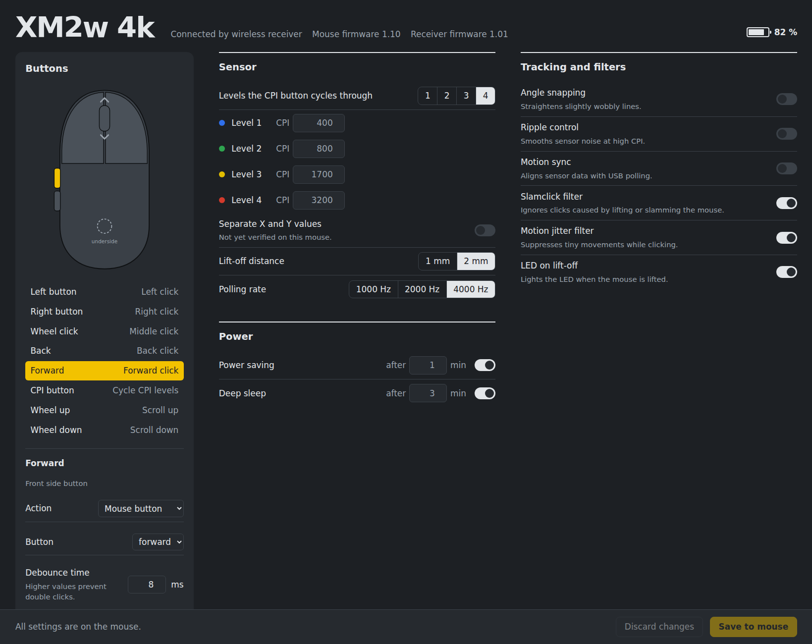

# xm2ctl

Configure the **Endgame Gear XM2w 4k** gaming mouse on Linux, over the USB cable or the
wireless receiver. Comes with a local web UI, a command line tool and a battery monitor
with desktop notifications. Pure Python standard library, no dependencies.

> **AI notice:** This project was developed with the assistance of AI (Anthropic's
> Claude). The USB protocol was reverse engineered from captures of the official
> Windows tool, and every feature listed as supported was tested on real hardware
> before release.

> **Disclaimer:** This is an unofficial community project. It is not affiliated with,
> endorsed by or supported by Endgame Gear. "Endgame Gear" and "XM2w" are trademarks of
> their respective owner. Use at your own risk; the official Windows tool's factory reset
> restores the default settings if anything goes wrong.

## Supported devices

| Device | Firmware | Status |
|---|---|---|
| XM2w 4k (v1), USB ID `3367:1968` wired / `3367:1970` receiver | mouse 1.10, receiver 1.01 | tested |

Other Endgame Gear mice use a similar protocol but different product IDs and are not
supported yet. Reports and captures from other models are welcome.

## Features

- Sensor: CPI levels (50–26000 in steps of 50) with optional separate X and Y values,
  active level count, lift-off distance, polling rate 1000/2000/4000 Hz (receiver only, like the official tool)
- Tracking: angle snapping, ripple control, motion sync, slamclick and jitter filters,
  LED on lift-off
- Clicks: debounce time per button, GX safe/speed mode for the main buttons
- Buttons: remap to mouse buttons, media keys, scroll, CPI cycling, keyboard keys and
  combinations (see known issues); left-handed mode
- Power: power saving and deep sleep timers
- Profiles: save named settings on this computer and switch between them
- Battery level, mouse and receiver firmware versions
- Every write is backed up first and verified by reading the config back

Not supported: firmware updates and receiver pairing (use the official tool).

## Known issues

**Keyboard key mappings need a kernel-side fix.** The mouse sends mapped keys correctly,
but the HID report descriptor in firmware 1.10 declares the keyboard key array with usage
minimum 1 instead of 0. Linux therefore reads every empty key slot as "ErrorRollOver" and
drops the whole report. Mouse button, scroll and media key mappings are not affected.
The HID-BPF program in [`hid-bpf/`](hid-bpf/) corrects that one byte, see below.
Details in [PROTOCOL.md](PROTOCOL.md).

## Install

    git clone https://github.com/mannomatico/xm2ctl.git
    cd xm2ctl
    sh install.sh

The script copies the package to `~/.local/share/xm2ctl`, installs a udev rule that gives
the logged-in user access to the mouse (asks for sudo once), starts the `xm2ctl` systemd
user service and adds an "XM2w 4k" launcher to the app grid.

Requirements: Linux with systemd, Python 3.9 or newer, `gdbus` for notifications
(part of GLib, present on GNOME and most desktops).

## Web UI

Open http://127.0.0.1:8341 or start "XM2w 4k" from the app grid. The service checks the
battery every 2 minutes and shows a desktop notification once it drops to 20 % or less.

Over the wireless receiver, the mouse is only queried while it is in use. A query to a
mouse in power saving or deep sleep can block the receiver until it is replugged (a
firmware issue, see [PROTOCOL.md](PROTOCOL.md)). The battery level therefore updates
while you use the mouse, and the web UI asks you to move the mouse if it has been idle.

Options go into `ExecStart` in `~/.config/systemd/user/xm2ctl.service`:

    --port 8341  --low-battery 20  --interval 120

    systemctl --user status xm2ctl
    journalctl --user -u xm2ctl

The server listens on 127.0.0.1 only, rejects requests with a foreign `Host` or `Origin`
header and requires a random per-start token for every write, so other websites open in
your browser cannot change the mouse settings. The token is also stored in
`$XDG_RUNTIME_DIR/xm2ctl/token`, readable by your user only, for the top bar extension.

## Top bar indicator (GNOME)

`install.sh` also installs a small GNOME Shell extension that shows the battery level in
the top bar, next to a mouse icon. It hides itself while no mouse is connected, turns
red at the low battery threshold and opens the web UI from its menu. It reads the cached
value from the service (`/api/battery`) and never talks to the mouse itself.

Its menu also lists your [profiles](#profiles), with a check mark at the one that matches
the mouse. Selecting a profile writes it to the mouse through the service and confirms
with a notification.

On Wayland, log out and back in once after the first install, then enable it:

    gnome-extensions enable xm2ctl@mannomatico.github.io

If it stays disabled, user extensions may be switched off globally:

    gsettings set org.gnome.shell disable-user-extensions false

## Command line

    cd ~/.local/share/xm2ctl
    python3 -m xm2ctl info
    python3 -m xm2ctl set --lod 1 --debounce left 10 --spdt right safe
    python3 -m xm2ctl set --map forward key:f5 --map back media:play-pause
    python3 -m xm2ctl set --polling 4000        # wireless receiver only
    python3 -m xm2ctl dump config.bin
    python3 -m xm2ctl restore ~/.local/state/xm2ctl/backup-YYYYMMDD-HHMMSS.bin

Run `python3 -m xm2ctl set --help` for all options. Over the receiver the CLI asks you
to move the mouse first unless the service has seen it move in the last few seconds.

## Profiles

The mouse has no profile slots of its own, so profiles live on the computer, as readable
JSON files in `~/.config/xm2ctl/profiles/`. Loading a profile writes it to the mouse like
any other change (with backup and verification). Over the cable the polling rate of a
profile is skipped, because it can only be changed over the receiver.

    python3 -m xm2ctl profile save gaming      # current mouse settings
    python3 -m xm2ctl profile list
    python3 -m xm2ctl profile load gaming
    python3 -m xm2ctl profile delete gaming

In the web UI, "Load" fills in the page and "Save to mouse" applies it. The profile that
matches the mouse is marked "on the mouse". The GNOME top bar menu switches profiles
directly.

## Keyboard fix (HID-BPF)

Requires a kernel with HID-BPF struct_ops support (6.11 or newer) and
[udev-hid-bpf](https://gitlab.freedesktop.org/libevdev/udev-hid-bpf).

    sudo dnf install udev-hid-bpf clang bpftool libbpf-devel kernel-headers
    sh hid-bpf/build.sh

Try it without installing (lasts until the receiver or cable is unplugged):

    udev-hid-bpf list-devices          # note the entries for 3367:1968 or 3367:1970
    sudo udev-hid-bpf add /sys/bus/hid/devices/0003:3367:1970.XXXX \
        hid-bpf/0010-EndgameGear__XM2w-4k.bpf.o

The program only binds to the interface with the broken descriptor; other interfaces
are skipped. `python3 -m xm2ctl info` shows `keyboard fix: active` once it is loaded.
Install it permanently for both the cable and the receiver:

    sudo udev-hid-bpf install hid-bpf/0010-EndgameGear__XM2w-4k.bpf.o

The program and the vendored kernel headers in `hid-bpf/` are licensed GPL-2.0-only.

## Protocol

See [PROTOCOL.md](PROTOCOL.md) for the reverse engineered USB HID protocol.

## Development

    python3 -m unittest discover tests

## Credits

- [egctl](https://github.com/Creationsss/egctl) by Creationsss, a configuration tool for
  the Endgame Gear OP1 8k v2. Its source was the starting point for understanding the
  config layout. No code was copied.
- [XM2w Control](https://github.com/qaustria/xm2w) by qaustria, a Tauri desktop app for
  the same mouse on macOS and Linux. Its sources confirmed parts of the protocol and the
  bootloader command documented in PROTOCOL.md.

## License

MIT, see [LICENSE](LICENSE), except the files in `hid-bpf/`, which are GPL-2.0-only as
required for HID-BPF programs.
